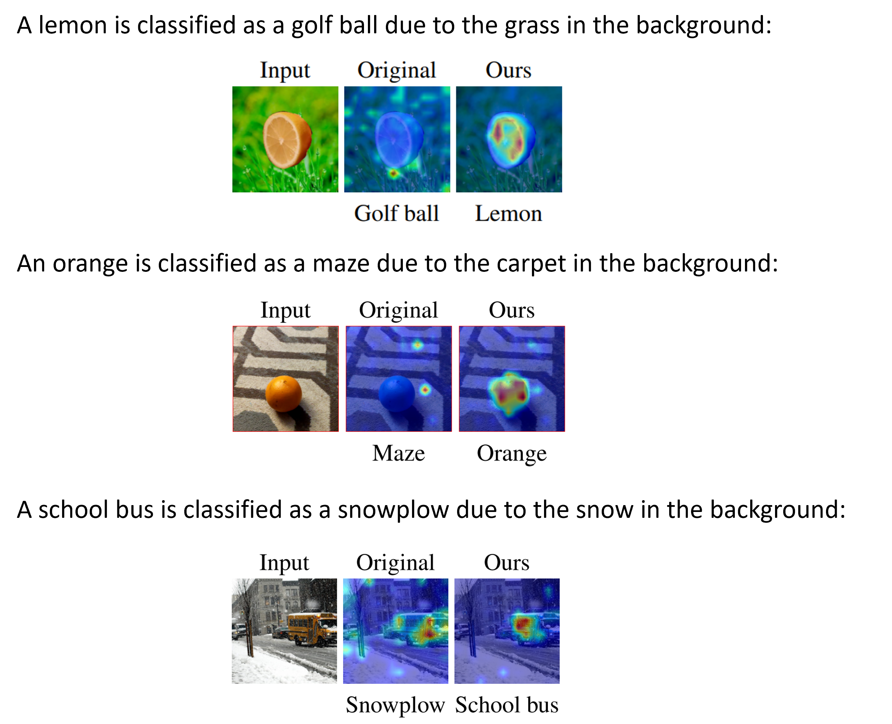

# [RobustViT](https://arxiv.org/abs/2206.01161): An Unoffical Pytorch Implementation

<p align="center">
  
</p>

This repo is a modification of the [official RobustViT repo](https://github.com/hila-chefer/RobustViT/). Please follow their instructions for installing any additional or conflicting requirements.

## [TokenCut](https://www.m-psi.fr/Papers/TokenCut2022/) for unsupervised segmentation

* Clone the [TokenCut repo](https://github.com/YangtaoWANG95/TokenCut) and follow their [instructions](https://github.com/YangtaoWANG95/TokenCut#2-installation) for installing other requirements.
* We provide a bash [command](https://github.com/Aaditya-Singh/RobustViT/blob/master/commands/gen_seg_inet.sh) to save the segmentation maps for images in [ImageNet subsets](https://github.com/Aaditya-Singh/RobustViT/tree/master/subsets/imagenet_subsets1).
* `--out-dir` flag can be used to specify the directory to save the segmentation maps.
* `--pretrained_pth` flag specifies the path to load the pre-trained [DINO ViTB-16](https://dl.fbaipublicfiles.com/dino/dino_vitbase16_pretrain/dino_vitbase16_pretrain.pth) model.

Note that we only use [CPUs](https://github.com/Aaditya-Singh/RobustViT/blob/master/tokencut_generate_segmentation.py#L32) for generating segmentation maps as we observed memory leakage for GPUs. Additionally, a [python script](https://github.com/Aaditya-Singh/RobustViT/blob/master/find_missing_tokencut.py) is provided to obtain the image indices that were skipped during the above process.

## Linear-probing self-supervised ViTs

The bash command used for linear-probing (SSL) ViTs on the different subsets can be found [here](https://github.com/Aaditya-Singh/RobustViT/blob/master/commands/lp_msn_inet.sh). We summarize some of the important flags for experimentation below:
* `seg_data`: Specifies the path to load the images and segmentation maps from, e.g. `subsets/tokencut_subsets1/5imgs_class/`
* `val_data`: Specifies the path to ImageNet validation data, e.g. `../datasets/ImageNet/imagenet/val/`
* `experiment_folder`: Specifies the path to save logs and model weights to, e.g. `logs/MSN_VITB_LP/IN_subsets1_5imgs_class/`
* `pretrained`: Specifies the path to load pre-trained model weights from, e.g. `pretrained/msn/vitb16_600ep.pth.tar`

## Fine-tuning ViTs

The bash command used for fine-tuning (linear-probed) ViTs on the different subsets can be found [here](https://github.com/Aaditya-Singh/RobustViT/blob/master/commands/ft_msn_inet.sh). Please refer to [README.md](https://github.com/hila-chefer/RobustViT#finetuning-vit-models) for more fine-tuning details.

## Evaluation and other notes
Please refer to [our codebase](https://github.com/Aaditya-Singh/Low-Shot-Robustness/) for testing instructions. The [fine-tuning code](https://github.com/Aaditya-Singh/RobustViT/blob/master/imagenet_finetune_tokencut.py) is modified for backwards compatibility.

## Bibtex
Please cite the original authors if you find this repository helpful:
```
@inproceedings{
chefer2022optimizing,
title={Optimizing Relevance Maps of Vision Transformers Improves Robustness},
author={Hila Chefer and Idan Schwartz and Lior Wolf},
booktitle={Thirty-Sixth Conference on Neural Information Processing Systems},
year={2022},
url={https://openreview.net/forum?id=upuYKQiyxa_}
}
```
